## Software architecture

"The software architecture is the structure or structures of the system, which comprise software elements, the externally visible properties of those elements and the relationships among them" (Len Bass)

## Recommended books

* No silver bullet (Paper by Frederick P. Brooks Jr, 1986) ([link](http://www.cs.nott.ac.uk/~pszcah/G51ISS/Documents/NoSilverBullet.html))
* Software Architecture: Foundations, Theory and Practice (Taylor, 2009)
* Software Architecture for Developers (Simon Brown, 2012)
* Patterns of Enterprise Application Architecture (Fowler, 2002)

## No Silver Bullet: Essence and Accidents of Software Engineering

* Essential Difficulties ("the difficulties inherent in the nature of software"):
	* Complexity
	* Conformity "...much complexity comes from conformation to other interfaces"
	* Changeability
	* Invisibility "Software is invisible and unvisualizable."

* Accidental Difficulties ("difficulties that today attend its production but are not inherent")

## Architecture styles

* Call and return
	* Main program and subroutine architecture

		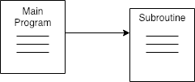
	* Remote procedure call architecture

		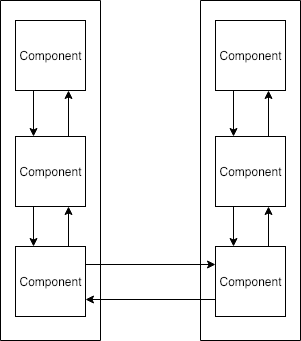
	* Object-oriented architectures

		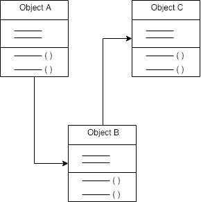
	* Layered architectures
		
		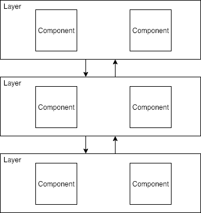

* Data-flow
	* Batch Sequential

		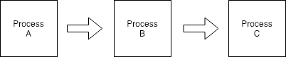
	* Pipe and Filter

		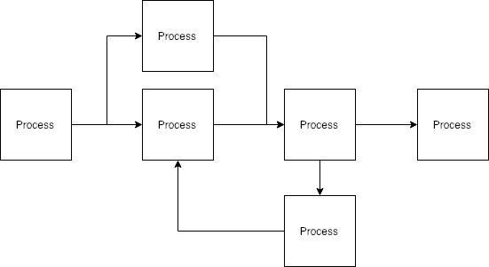
	* Process Control
		The data is neither batched sequential nor pipelined stream. The flow of data comes from a set of variables, which controls the execution of process. It decomposes the entire system into subsystems or modules and connects them.

* Data-centered
	* Blackboard

		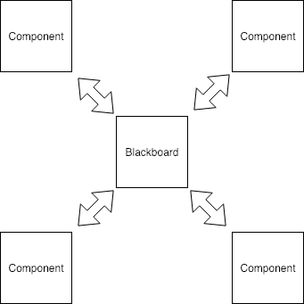
	* Repository

		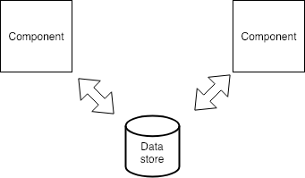
	* Expert system rule-based

		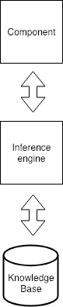

* Independent components
	* Implicit invocation

		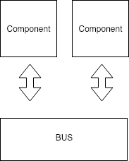
	* Explicit invocation

		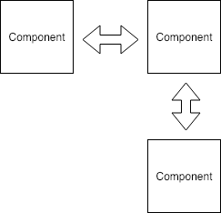

## Architecture patterns categories

* Monolithic Architecture Patterns
	* Advantages:
		* Efficiency
		* Modifiability
		* Testability
		* Learnability

* Distributed Architecture Patterns
	* Advantages:
		* Modularity
		* Availability
		* Performance
		* Adaptability

## Architecture patterns

* MVC
* Layered Pattern
* Microkernel - plug-in
* CQRS
* Event-driven
* Microservices
* Domain-driven
* Hexagonal
* Shared-Nothing
* Combined